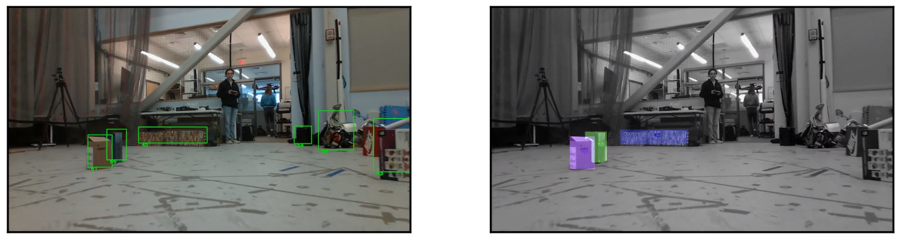

# ROMAN



Welcome to ROMAN(<ins>R</ins>obust <ins>O</ins>bject <ins>M</ins>ap <ins>A</ins>lignment A<ins>n</ins>ywhere).
ROMAN is a view-invariant global localization method that maps open-set objects and uses the geometry, shape, and semantics of objects to find the transformation between a current pose and previously created object map.

Included in this repository is code for open-set object mapping and object map registration using our robust data association algorithm.

# Install

First, **activate any virtual environment you would like to use with ROMAN**.

Then, clone and install with:

```
git clone git@github.com:mit-acl/roman.git
./roman/install.sh
```

# Demo

1. Set the following environment variables (consider putting in `.bashrc` for running repeatedly):

```
export BAG_PATH=<path to Kimera Multi bag file>
export GT_PATH=<path to Kimera Multi ground truth csv file>
export FASTSAM_WEIGHTS_PATH=<path to FastSAM weights>
export ROBOT=<acl_jackal, acl_jackal2, sparkal1, sparkal2, hathor, thoth, apis, OR sobek>
```

2. `cd` into `./demo` and run `python3 ./demo.py -p ./params/kmd_gt.yaml -o <output prefix (without file extensions)`

---

This research is supported by Ford Motor Company, DSTA, ONR, and
ARL DCIST under Cooperative Agreement Number W911NF-17-2-0181.

