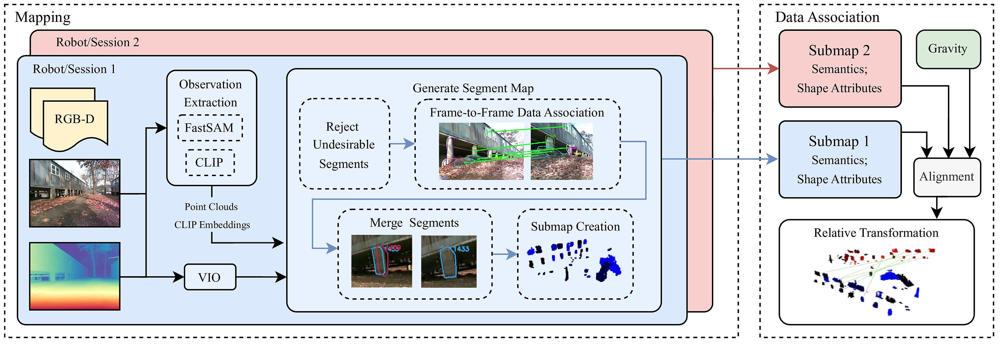

# ROMAN


Welcome to ROMAN(<ins>R</ins>obust <ins>O</ins>bject <ins>M</ins>ap <ins>A</ins>lignment A<ins>n</ins>ywhere).
ROMAN is a view-invariant global localization method that maps open-set objects and uses the geometry, shape, and semantics of objects to find the transformation between a current pose and previously created object map.
This enables loop closure between robots even when a scene is observed from *opposite views.*

Included in this repository is code for open-set object mapping and object map registration using our robust data association algorithm.
For ROS1/2 integration, please see the [roman_ros](https://github.com/mit-acl/roman_ros) repo. 
Further information, including demo videos can be found [here](https://acl.mit.edu/roman).

## Citation

If you find ROMAN useful in your work, please cite our [paper](https://www.roboticsproceedings.org/rss21/p029.pdf):

M.B. Peterson, Y.X. Jia, Y. Tian, A. Thomas, and J.P. How, "ROMAN: Open-Set Object Map Alignment for Robust View-Invariant Global Localization,"
*Robotics: Science and Systems*, 2025.

```
@article{peterson2025roman,
  title={ROMAN: Open-Set Object Map Alignment for Robust View-Invariant Global Localization},
  author={Peterson, Mason B and Jia, Yi Xuan and Tian, Yulun and Thomas, Annika and How, Jonathan P},
  booktitle={Robotics: Science and Systems (RSS)},
  pdf={https://www.roboticsproceedings.org/rss21/p029.pdf},
  year={2025}
}
```

## System Overview



ROMAN has three modules: mapping, data association, and
pose graph optimization. The front-end mapping pipeline tracks
segments across RGB-D images to generate segment maps. The data
association module incorporates semantics and shape geometry attributes from submaps along with gravity as a prior into the ROMAN
alignment module to align maps and detect loop closures. These loop
closures and VIO are then used for pose graph optimization.

The `roman` package has a Python submodule corresponding to each pipeline module. Code for creating open-set object maps can be found in `roman.map`. Code for finding loop closures via data association of object maps can be found in `roman.align`. Finally, code for interfacing ROMAN with Kimera-RPGO for pose graph optimization can be found in `roman.offline_rpgo`.

## Dependencies

Direct dependencies, [CLIPPER](https://github.com/mit-acl/CLIPPER) and [Kimera-RPGO](https://github.com/MIT-SPARK/Kimera-RPGO) are installed with the install script. 
If you would like to use Kimera-RPGO with ROMAN (required for full demo), please also follow the [Kimera-RPGO dependency instructions](https://github.com/MIT-SPARK/Kimera-RPGO#Dependencies).
To get this working, you may need to edit the LD_LIBRARY_PATH with the following: `export LD_LIBRARY_PATH=$LD_LIBRARY_PATH:/usr/local/lib`.

## Install

First, **activate any virtual environment you would like to use with ROMAN**.

Then, clone and install with:

```
git clone git@github.com:mit-acl/roman.git roman
./roman/install.sh
```

## Demo

A short demo is available to run ROMAN on small subset of the [Kimera Multi Data](https://github.com/MIT-SPARK/Kimera-Multi-Data).
The subset includes two robots (`sparkal1` and `sparkal2`) traveling along a path in opposite directions. 
We demonstrate ROMAN's open-set object mapping and object-based loop closure to estimate the two robots' cumulative 200 m long trajectories with 1.2 m RMSE absolute trajectory error using our vision-only pipeline.

Instructions for running the demo:

1. Download a small portion of the [Kimera Multi Data](https://github.com/MIT-SPARK/Kimera-Multi-Data) that is used for the ROMAN SLAM demo. The data subset is available for download [here](https://drive.google.com/drive/folders/1ANdi4IyroWzJmd85ap1V-IMF8-I9haUB?usp=sharing).

2. In your `.bashrc` or in the terminal where you will run the ROMAN demo export the following environment variables: 

```
export ROMAN_DEMO_DATA=<path to the demo data>
export ROMAN_WEIGHTS=<path to this repo>/weights
```

Note that by default, FastSAM and CLIP are run on GPU, but if you would like to run on CPU, change the `device` field in [this parameter file](./params/demo/fastsam.yaml) to `cpu`. Note that this will cause the demo to run much slower than real-time.

3. `cd` into this repo and run the following to start the demo

```
mkdir demo_output
python3 demo/demo.py \
    -p params/demo \
    -o demo_output
```

Here, the `-p` argument specifies the parameter directory and the `-o` argument specifies the output directory.

Optionally, the mapping process can be visualized with the `-m` argument to show the map projected on the camera image as it is created or `-3` command to show a 3D visualization of the map.
However, these will cause the demo to run slower. 

The output includes map visualization, loop closure accuracy results, and pose graph optimization results including root mean squared absolute trajectory error. 

<!--  -->

## Running on Custom Data

ROMAN requires RGB images, depth data (either as RGB-aligned depth images or point clouds), odometry information, and transforms between data sources. ROMAN should be runnable on any data with this information, using [robotdatapy](https://github.com/mbpeterson70/robotdatapy) to interface [pose data](https://github.com/mbpeterson70/robotdatapy/blob/main/robotdatapy/data/pose_data.py), [image data](https://github.com/mbpeterson70/robotdatapy/blob/main/robotdatapy/data/img_data.py), and possibly [point cloud data](https://github.com/mbpeterson70/robotdatapy/blob/main/robotdatapy/data/pointcloud_data.py). Currently supported data types include ROS1/2 bags, zip files of images, and csv files for poses, with additional data sources in development. 
Click [here](./demo/README.md/#custom-data) for more information on running on custom data.

## Acknowledgements

This research is supported by Ford Motor Company, DSTA, ONR, and
ARL DCIST under Cooperative Agreement Number W911NF-17-2-0181.

Additional thanks to Yun Chang for his help in interfacing with Kimera-RPGO.
